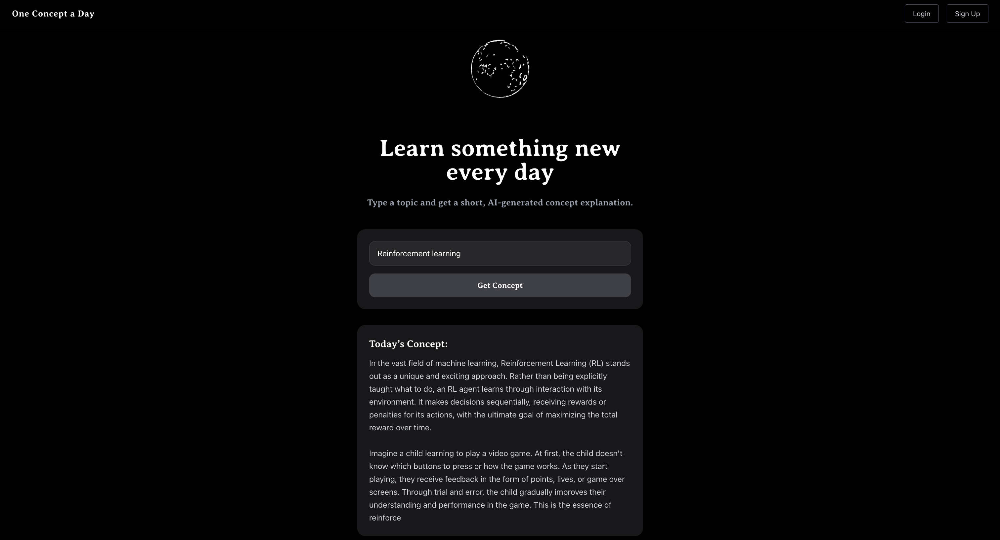
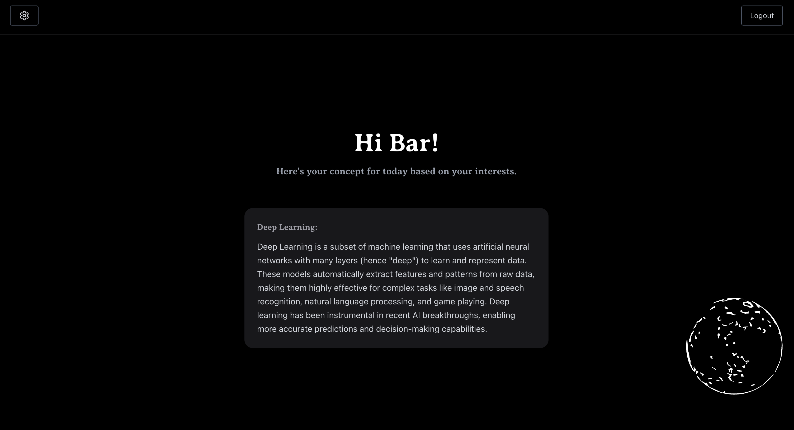

# One Concept a Day

**AI-Powered Learning Platform** - React + TypeScript + FastAPI + OpenRouter AI + MongoDB Atlas + AWS EC2

A learning platform that generates personalized educational content using AI, demonstrating modern full-stack development with cloud architecture and security practices.

## Architecture Overview

- **Frontend:** React 18 + TypeScript with component-based architecture
- **Backend:** FastAPI with async Python and layered service architecture  
- **Database:** MongoDB Atlas with optimized queries and indexing
- **AI Engine:** OpenRouter API integration with prompt engineering
- **Infrastructure:** AWS EC2 deployment with environment management
- **Security:** NoSQL injection and XSS attack prevention

## Core Technical Features

- **Multi-Model AI Integration** - OpenRouter platform for LLM access and fallback mechanisms
- **Cloud Database** - MongoDB Atlas with proper indexing and aggregation pipelines
- **Security Testing** - Automated NoSQL injection and XSS attack simulation
- **Service Architecture** - Scalable service layers with clean separation of concerns
- **Type Safety** - TypeScript with Pydantic validation

## System Architecture

```
Frontend (React/TS) ←→ FastAPI (Python) ←→ MongoDB Atlas (Cloud)
                              ↓
                    OpenRouter AI Services
                              ↓
                       AWS EC2 (Production)
```

## Key Features

- **AI Content Generation** - OpenRouter API integration for dynamic educational concepts
- **Smart Personalization** - History tracking to avoid repetitive content
- **Security Testing** - Comprehensive NoSQL injection and XSS prevention
- **FARM Stack** - React 18 + TypeScript + FastAPI + MongoDB
- **Production Ready** - Deployed on AWS EC2

## Project Structure

```
one-concept-a-day/
├── client/                  # React TypeScript Frontend
│   ├── src/
│   │   ├── api/             # API client services
│   │   ├── components/      # React components
│   │   │   ├── auth/        # Authentication UI
│   │   │   ├── dashboard/   # Main dashboard
│   │   │   ├── features/    # Custom hooks
│   │   │   └── home/        # Landing page
├── server/                  # FastAPI Python Backend
│   ├── app/
│   │   ├── ai/             # AI service layer
│   │   ├── api/            # REST endpoints
│   │   ├── db/             # Database layer
│   │   ├── models/         # Data models
│   │   ├── security/       # Auth & security
│   │   └── services/       # Business logic
│   ├── tests/              # Comprehensive test suite
│   ├── requirements.txt
```

## Development Workflow

```bash
# Quick start - runs both frontend and backend
npm run dev

# Run services separately
npm run client    # Frontend only
npm run server    # Backend only

# Install all dependencies
npm run install:all

# Build for production
npm run build

# Run tests
npm test
```

## Tech Highlights

**AI Integration:**
- OpenRouter API for multi-model LLM access
- Advanced prompt engineering with context awareness
- AI safety measures and input sanitization

**Security:**
- Automated security testing with real attack simulations
- JWT authentication with secure middleware
- NoSQL injection prevention with comprehensive validation

**Testing:**
- 6 comprehensive test suites covering security, auth, and API
- NoSQL injection attack simulation
- XSS prevention testing
- Authentication middleware validation

**Architecture:**
- Clean layered architecture (API → Services → Repository → Database)
- Type-safe development with TypeScript and Pydantic
- Repository pattern with MongoDB integration

## Screenshots




## Live Demo

**Production App:** AWS EC2 deployment (link in CV)  
**Source Code:** https://github.com/bartawil/one-concept-a-day.git

---

Developed by Bar Tawil